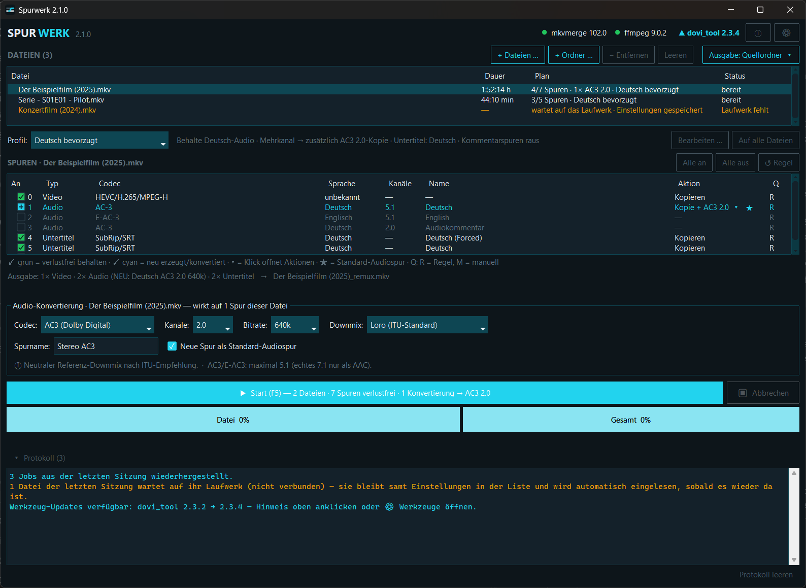
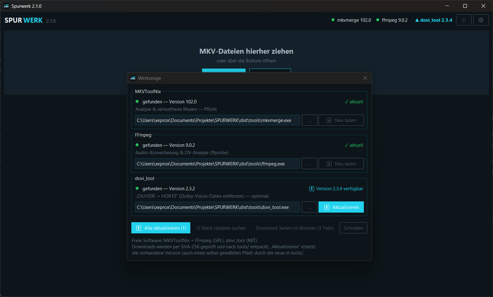
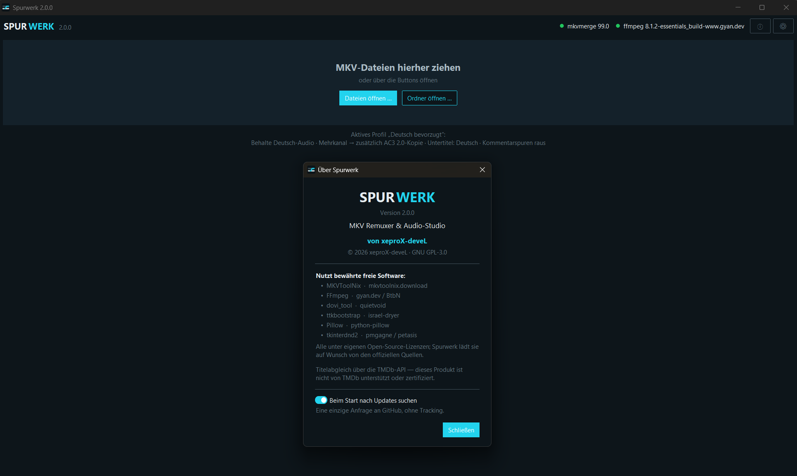

# Spurwerk

**Der einfache Weg, MKV-Filme aufzuräumen — ohne Qualitätsverlust.**

Spurwerk nimmt deine MKV-Dateien und macht sie so, wie du sie brauchst:
unnötige Sprachen raus, auf Wunsch eine kompatible Tonspur dazu, und
4K-Filme mit Farbstich-Problemen werden repariert. Das Videobild wird
dabei **niemals neu berechnet** — was reinkommt, kommt in Originalqualität
wieder raus. Deine Originaldateien bleiben immer unangetastet.

**Download:** [aktuelle Version — GitHub-Releases](https://github.com/xeprox-devel/spurwerk/releases/latest)
· [Projektseite mit Anleitung](https://ricardo-rehfeldt.de/tools/spurwerk/)

  

  
  

---

## Warum Spurwerk?

Für das, was Spurwerk in **einem Durchgang** macht, brauchte man bisher
**mehrere Programme nebeneinander** — und musste bei jedem die Eigenheiten
kennen:

- **MKVToolNix** remuxt verlustfrei, kann aber kein Audio umwandeln und
  hat keine Automatik über viele Dateien hinweg.
- **FFmpeg-Oberflächen** wandeln Audio um, denken aber in Kommandozeilen
  statt in Spuren — und ob das Video wirklich unberührt bleibt, ist oft
  undurchsichtig.
- **Extraktions-Tools** können Spuren nur zerlegen, nicht wieder
  zusammensetzen.
- **Dolby-Vision-Reparatur** war Handarbeit mit `dovi_tool` auf der
  Kommandozeile.

Spurwerk führt das in **einem Werkzeug** zusammen: Spuren verlustfrei
auswählen, dabei bei Bedarf eine kompatible Tonspur erzeugen, Dolby Vision
gerätegerecht anpassen — gesteuert von einer Sprachregel-Automatik, die dir
**vorher in Klartext zeigt**, was passieren wird. Alles verlustfrei, wo es
geht; das Videobild wird nie neu komprimiert.

Der Anspruch dahinter: die **Übersicht eines einfachen Tools** mit der
**Kontrolle eines Profi-Werkzeugs** verbinden — deutschsprachig, mit
Stapelverarbeitung als Normalfall und einer Ein-Klick-Einrichtung, die
sich die nötigen Werkzeuge selbst holt.

> **Ehrlich bleibt:** Für exotische Matroska-Spezialfälle (Kapitel-Editor,
> Tags, Anhänge im Detail) ist MKVToolNix weiterhin die Referenz. Spurwerk
> zielt auf die **alltäglichen Aufgaben** — und macht die richtig gut.

---

## Was kann Spurwerk?

**🧹 Ausmisten (verlustfrei):**
Ein Film hat 6 Sprachen und 12 Untertitel, du brauchst nur Deutsch?
Häkchen setzen, Start — fertig in Sekunden. Das nennt man „Remuxen":
Es wird nur neu verpackt, nichts umgerechnet.

**🔊 Kompatible Tonspur erzeugen:**
Dein Fernseher, deine Soundbar oder dein Tablet kann kein DTS oder kein
7.1? Spurwerk erzeugt aus der Originalspur eine Dolby-Digital- (AC3/E-AC3)
oder AAC-Spur — wahlweise in 5.1 oder Stereo, mit hochwertigen
Downmix-Profilen. Das Original kannst du behalten oder ersetzen.

**🎨 Dolby Vision — behalten oder entfernen (verlustfrei):**
Manche 4K-MKVs mit Dolby Vision zeigen auf einigen Geräten einen
Grün-/Lilastich, auf anderen laufen sie einwandfrei. Spurwerk erkennt
das Format automatisch und gibt dir pro Datei (Rechtsklick auf die
Videospur) genau zwei Wahlmöglichkeiten:
- **Kopieren** — Video unangetastet, DV (und HDR10+) bleiben komplett
- **DV/HDR entfernen → HDR10** — die Dolby-Vision-Daten kommen raus,
  übrig bleibt reines HDR10, das **überall läuft** — auch auf
  Einplatinen-Playern (ROCK64 & Co.) und älteren TVs. HDR10+ bleibt
  erhalten; Untertitel, Ton und Kapitel bleiben automatisch 1:1.

Beides ohne Neuberechnung des Bildes. Profil 5 (kein HDR10-Fallback)
wird mit Begründung gesperrt, statt kaputte Farben zu erzeugen.

Der Kompatibilitätsmodus denkt dabei auch an die Untertitel: Bild-
Untertitel (PGS) springen in der Ausgabe nicht mehr automatisch an —
eine automatisch aktive Bild-Spur zwingt Player wie Jellyfin sonst zum
Einbrennen (Transkodierung), und die Wiedergabe startet je nach Server
gar nicht. Gibt es eine Textspur gleicher Sprache, übernimmt die die
Automatik — Zwangs-Untertitel funktionieren damit weiter, nur eben als
Text im Direct Play.

**🗂 Viele Dateien auf einmal:**
Ganze Serienstaffel reinziehen, Regeln einmal festlegen (oder pro Datei
anpassen), ein Klick auf Start — Spurwerk arbeitet die Liste ab.
Erledigte Dateien verschwinden aus der Warteschlange, Fehler bleiben
sichtbar. Deine Warteschlange und Einstellungen bleiben beim nächsten
Start erhalten.

**🏷 Saubere Dateinamen (optional):**
Aus `Film.2025.UHD.WEB-DL.HEVC…mkv` wird `Film.mkv` — komplett offline.
Auf Wunsch gleicht Spurwerk den Titel zusätzlich online mit **TMDb** ab
und liefert die exakte Schreibweise (z. B. „Obsession - Du sollst mich
lieben"). Je nach Ausgabe funktioniert das direkt oder mit einem eigenen,
kostenlosen TMDb-Key. Alles umschaltbar im Ausgabe-Menü; ohne Netz greift
immer die Offline-Variante.

## So startest du

1. **[`Spurwerk.exe` herunterladen](https://github.com/xeprox-devel/spurwerk/releases/latest)**
   und in einen beliebigen Ordner legen
   (keine Installation nötig).
2. **Beim ersten Start** bietet Spurwerk an, die benötigten freien
   Werkzeuge automatisch herunterzuladen: MKVToolNix und FFmpeg
   (Pflicht) sowie dovi_tool (optional, für „DV/HDR → HDR10").
   Ein Klick, einmalig, fertig. Gibt es später neue Versionen, zeigt
   Spurwerk oben einen **▲-Hinweis** — ein Klick im Werkzeuge-Dialog
   (⚙) aktualisiert einzeln oder alle auf einmal.
3. **MKV-Dateien ins Fenster ziehen.** Spurwerk analysiert sie, wendet
   dein Profil an (z. B. „Deutsch bevorzugt") und zeigt dir in Klartext,
   was passieren wird. Passt? **Start.**

> **Windows-Hinweis:** Beim ersten Start kann Windows SmartScreen warnen
> („Unbekannter Herausgeber") — das ist bei kostenlosen Tools ohne
> teures Code-Zertifikat normal. Über „Weitere Informationen →
> Trotzdem ausführen" geht es weiter.

## Die Bedienung in einem Bild

- **Dateiliste oben:** deine Warteschlange. Jede Datei kann ihr eigenes
  Profil und Zielformat haben — die Plan-Spalte zeigt es an.
- **Profil-Zeile:** wählt die Automatik („Deutsch bevorzugt",
  „Nur remuxen — alles behalten", …). Über **Bearbeiten…** baust du
  eigene Profile, **Auf alle Dateien** überträgt die Einstellung.
- **Spurtabelle:** das Herzstück. Jede Zeile eine Spur — Häkchen =
  kommt mit. Klick auf die Aktion-Spalte einer Audiospur:
  *Kopieren*, *Kopie + Konvertierung* oder *Ersetzen*.
  Rechtsklick auf die Videospur: Dolby-Vision-Reparatur.
- **Start-Button:** sagt vorher exakt, was passiert
  („5 Dateien · 12 Spuren verlustfrei · 3 Konvertierungen → AC3 5.1").

## Häufige Fragen

**Werden meine Originaldateien verändert?**
Nein, niemals. Spurwerk schreibt immer neue Dateien (Standard:
`Film_remux.mkv` daneben). Ausgabeort und -name sind änderbar
(Rechtsklick auf die Datei).

**Was heißt „verlustfrei"?**
Beim Remuxen und bei der DV-Reparatur werden Video und Ton bitgenau
kopiert — null Qualitätsverlust. Nur wenn du bewusst eine neue Tonspur
erzeugst (z. B. DTS → Dolby Digital), wird diese eine Spur neu kodiert.

**Warum gibt es 7.1 nur als AAC?**
AC3 endet technisch bei 5.1, und FFmpeg kann kein echtes E-AC3 7.1
erzeugen. Spurwerk bietet ehrlich nur an, was wirklich geht — und
rechnet nie künstlich hoch (kein Fake-7.1).

**Warum ist „DV entfernen" bei manchen Dateien gesperrt?**
Dolby Vision **Profil 5** hat kein HDR10-Fallback — ohne die DV-Daten
wären die Farben kaputt. Spurwerk sperrt das und erklärt warum, statt
eine unbrauchbare Datei zu erzeugen.

**Warum springen Bild-Untertitel nach „DV/HDR → HDR10" nicht mehr automatisch an?**
Weil genau das die Wiedergabe killen kann: Eine automatisch aktive
PGS-Spur zwingt Player wie Jellyfin zum Einbrennen — der Server muss
den kompletten 4K-Film transkodieren, und je nach Hardware startet der
Film dann gar nicht. Die Bild-Untertitel bleiben vollständig in der
Datei (im Player zuschaltbar); gibt es eine Textspur gleicher Sprache,
übernimmt die die Automatik.

**Welche Systemvoraussetzungen?**
Windows 10/11 (64-bit). Die Werkzeuge lädt Spurwerk selbst.

**Telefoniert Spurwerk nach Hause?**
Nein, kein Tracking. Beim Start fragt Spurwerk nur die Versionsnummern ab:
bei GitHub für sich selbst und für dovi_tool, bei mkvtoolnix.download und
bei gyan.dev für die übrigen Werkzeuge (alles zusammen abschaltbar im
„Über"-Dialog).
Der optionale Titelabgleich sendet nur den Suchtitel an TMDb. Sonst geht
nichts raus.

**Gibt es Tastenkürzel?**
Ja: `F5` startet, `Strg+O` fügt Dateien hinzu, `Strg+Umschalt+O` einen
ganzen Ordner, `Entf` entfernt die markierte Datei aus der Liste.

## Die Werkzeuge dahinter

Spurwerk orchestriert bewährte freie Software: **MKVToolNix**
(mkvtoolnix.download), **FFmpeg** (gyan.dev/BtbN) und **dovi_tool**
(quietvoid) für „DV/HDR → HDR10". Spurwerk liefert sie nicht mit,
sondern lädt sie auf Wunsch per Ein-Klick, geprüft per SHA-256, und
hält sie auf Wunsch aktuell.

Der optionale Titelabgleich nutzt die **TMDb-API**, ist aber nicht von
TMDb unterstützt oder zertifiziert.

---

Version: siehe Titelleiste · Änderungen: [CHANGELOG.md](CHANGELOG.md) ·
Für Entwickler: [DEVELOPMENT.md](DEVELOPMENT.md)

© xeproX-deveL · gebaut mit Python & ttkbootstrap · Lizenz: [GPL-3.0](LICENSE)
